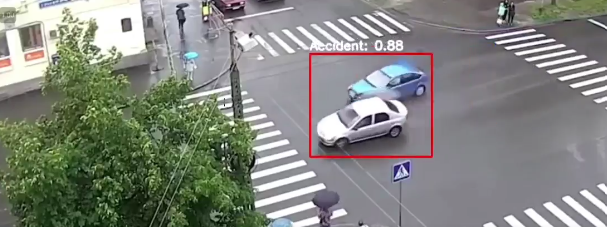
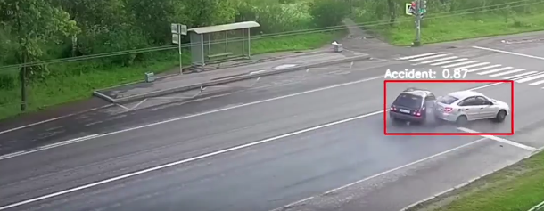

# 🚗 Car Accident Detection using YOLOv8


## 📌 Overview
This project detects car accidents in real-time using **YOLOv8** from **Ultralytics**, powered by **OpenCV** for video processing.  
The model is trained on annotated accident datasets from **Roboflow** and can work on both live camera feeds and pre-recorded videos.

## ✨ Features
- Real-time accident detection using YOLOv8
- Support for video files and webcam streams
- Bounding boxes with confidence scores
- Dataset annotation and training using Roboflow
- Easy integration into other systems

## 🛠️ Tech Stack
- **Language**: Python  
- **Computer Vision**: OpenCV  
- **Object Detection Model**: YOLOv8 (Ultralytics)  
- **Dataset**: Roboflow custom dataset  
- **Environment**: Jupyter Notebook / Python Script

## ⚙️ How It Works
1. **Dataset Preparation** – Accident images are labeled using Roboflow.
2. **Model Training** – YOLOv8 model is trained on the annotated dataset.
3. **Detection** – OpenCV captures frames and sends them to YOLOv8 for inference.
4. **Output** – Displays detected accidents with bounding boxes in real-time.




## 🚀 Getting Started

### 1️⃣ Clone the Repository
```bash
git clone https://github.com/yourusername/car-accident-detection.git
cd car-accident-detection
